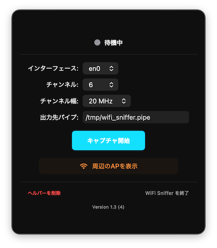
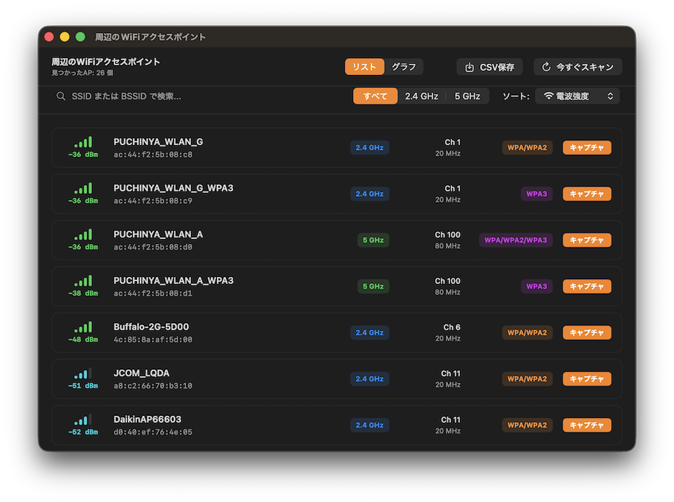

# WiFiSnifferTool for MacOS

macOSで動作するWiFiスニファーツールです。特権ヘルパーを使用してWiFiパケットをキャプチャし、Wiresharkでリアルタイムに解析することができます。

## 主な機能

- Wifiのパケットキャプチャを行いリアルタイムでWiresharkに表示する
- 周辺のアクセスポイントの一覧表示およびグラフ表示

## システム要件

- MacOS 15~ (Apple Silicon)
- Wiresharkがインストールされていること

## インストール

以下からビルド済みのもの(WiFiSnifferTool.app.zip)をダウンロードしてください。  
https://github.com/puchinya/WiFiSnifferTool/releases

圧縮ファイル展開後にアプリケーションフォルダにWiFiSnifferTool.appをコピーしてください。  
(Safariでダウンロードした場合は自動的に展開されています。)  
その後、アプリケーションを起動してください。  
アプリケーション起動後に以下の設定が必要です。  
- システム設定=>一般=>ログイン項目と拡張機能のWifiSnifferToolsをONにする。  
* WiFiパケットキャプチャには特権での実行が必要になるため、この設定が必要です。
- システム設定=>プライバシーとセキュリティ=>位置情報サービス=>WifiSnifferToolをONにする。  
*周辺無線APのSSID名を表示するのに必要です。

## 使い方

### WiFiキャプチャ
トレイアイコンをクリックして、キャプチャ対象のチャンネル等を設定後にキャプチャ開始ボタンを押してください。  
WireSharkが起動されて、キャプチャが開始されます。

WireSharkでの復号化方法.  
https://www.daradara.net/packet-capture/wireshark_wifi_packet_decrypt_for_mac/

## License

This project is licensed under the MIT License - see the [LICENSE.md](LICENSE.md) file for details.
